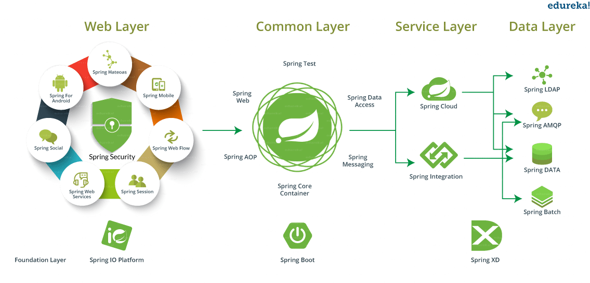
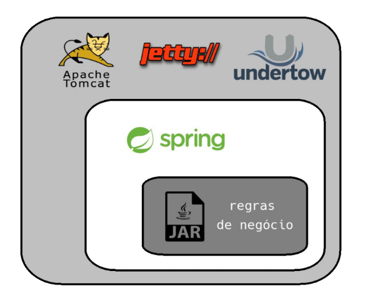
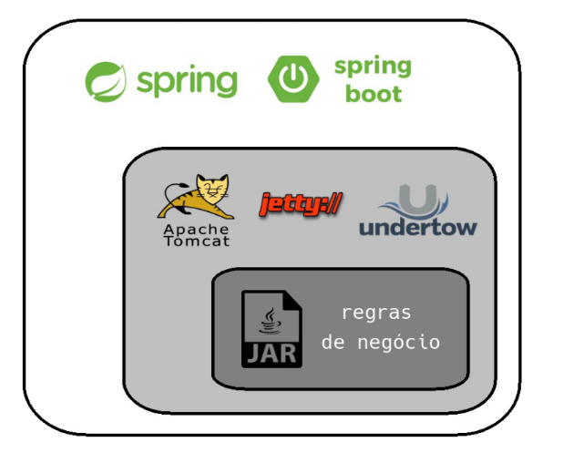

# Aula 1

- Apresentação da galera
- Apresentação do nosso processo
- Apresentação do nosso cronograma
- Introdução ao Maven
- Criaçãdo de um novo Projeto Maven
- Revisão Java
- Spring

---

# PARTE 1

## [Maven](https://maven.apache.org/)

O Maven é uma ferramenta de gerenciamento, construção e implantação de projetos que te ajuda no processo de **gerenciamento de dependências**, **build**, geração de relatórios e de documentação.

A unidade básica de configuração do Maven é um arquivo chamado `pom.xml`, que deve ficar na raiz do seu projeto. Ele é um arquivo conhecido como *Project Object Model*: lá você declara a estrutura, dependências e características do seu projeto.

Exemplo de um arquivo `pom.xml`:

```xml
<project>
  <modelVersion>4.0.0</modelVersion>

  <groupId>br.com.cwi.crescer</groupId>
  <artifactId>me-leva-ai</artifactId>
  <version>1.0.0-SNAPSHOT</version>

  <properties>
    <maven.compiler.target>1.8</maven.compiler.target>
    <maven.compiler.source>1.8</maven.compiler.source>
  </properties>

  <dependencies>
    <dependency>
        <groupId>junit</groupId>
        <artifactId>junit</artifactId>
        <version>4.13-beta-3</version>
        <scope>test</scope>
    </dependency>
  </dependencies>
</project>
```

### Comandos 

O mavem funciona através de um executável chamado `mvn`. Portanto todos os comandos devem ser precedidos desse executável.

O build do Maven é baseado no conceito de ciclo de vida: o processo de construção e distribuição da sua aplicação é dividido em partes bem definidas chamadas fases, seguindo um ciclo. O ciclo padrão é o seguinte

| Comando | Descrição | Exemplo | 
| ------- | --------- | ------- | 
| compile | compila o código fonte do projeto | `mvn compile` | 
| test | executa os testes unitários do código compilado, usando uma ferramenta de testes unitários, como o junit. | `mvn test`|
| package | empacota o código compilado de acordo com o empacotamento escolhido, por exemplo, em JAR. | `mvn package` | 
| integration-test | processa e faz o deploy do pacote em um ambiente onde os testes de integração podem ser rodados. | `mvn integration-test` | 
| install | instala o pacote no repositório local, para ser usado como dependência de outros projetos locais | `mvn install` | 
| deploy | feito em ambiente de integração ou de release, copia o pacote final para um repositório remoto para ser compartilhado entre desenvolvedores e projetos | `mvn deploy` | 

#### Material Complementar

- [Caelum - Processo de build com o maven](http://blog.caelum.com.br/processo-de-build-com-o-maven/)
- [IntelliJ IDEA](https://www.jetbrains.com/idea/download/#section=windows)
- [JDK 8](https://www.oracle.com/java/technologies/javase/javase-jdk8-downloads.html)
- [Maven](https://maven.apache.org/download.cgi) 


## Hands On

### Objetivo 1

- Criar um projeto Maven vazio utilizando JDK 1.8 com nome `projeto1`
- Adicionar um módulo maven
  - group-id: `br.com.cwi.crescer`
  - artifact-id: `projeto1`
  - version: `1.0.0`
- Criar um novo package: `br.com.cwi.crescer.projeto1`
- Criar uma classe `Projeto1Application` que possui um método de inicialização (public static void main)
- Printar "Hello World" no console


### Objetivo 2

- Criar um package `domain` e nesse package:
- Criar uma estrutura de classes que me permita instanciar:
   - Carteira Nacional de Habilitação
      - Número
      - Categoria (`A`, `B`, `C`, `D`, `E` e `ACC`)
      - Data Vencimento
   - Motorista
      - Nome completo
      - E-Mail
      - Data de Nascimento
      - CPF
      - Carteira de Habilitação

### Objetivo 3

- Implementar uma maneira de obter a idade de um Motorista


### Objetivo 4
- No package `domain`, criar uma classe que permita instanciar:
   - Passageiro
      - Nome completo
      - E-Mail
      - Data de Nascimento
      - CPF
- Implementar uma maneira de obter a idade de um Passageiro


### Objetivo 5

- Alterar as categorias de CNH para que possuam uma descrição conforme a seguir:

  - A: Todos os veículos automotores e elétricos, de duas ou três rodas, com ou sem carro lateral.
  - B: Veículos automotores e elétricos, de quatro rodas cujo peso bruto total não exceda a três mil e quinhentos quilogramas e cuja lotação não exceda a 08 (oito) lugares.
  - C: Todos os veículos automotores e elétricos utilizados em transporte de carga, cujo peso bruto total exceda a três mil e quinhentos quilogramas.
  - D: Veículos automotores e elétricos utilizados no transporte de passageiros, cuja lotação exceda a 08 (oito) lugares e, todos os veículos abrangidos nas categorias.
  - E: Combinação de veículos em que a unidade tratora se enquadre nas categorias B, C ou D e cuja unidade acoplada, reboque, semirreboque, trailer ou articulada tenha 6.000 kg (seis mil quilogramas) ou mais de peso bruto total, ou cuja lotação exceda a 8 (oito) lugares e, todos os veículos abrangidos pelas categorias B, C e D.
  - ACC: Veículos de duas ou três rodas, providos de um motor de combustão interna, cuja cilindrada não exceda a cinquenta centímetros cúbicos (3,05 polegadas cúbicas) e cuja velocidade máxima de fabricação não exceda a cinquenta quilômetros por hora.


### Objetivo 6

- Criar uma regra de validação para verificar se um Passageiro possui ao menos 16 anos;


### Objetivo 7

- Criar uma exception customizada para representar o erro de validação de idade mínima


---

# PARTE 2

## Especificação Java Enterprise

- Nomenclatura [J2EE > JavaEE > JakartaEE](https://en.wikipedia.org/wiki/Java_Platform,_Enterprise_Edition)
- Conjunto de especificações que adiciona ao Java SE funcionalidades para sistemas distribuídos.
   - **JSP**: Java Server Pages - Tecnologia que permite criar páginas HTML dinâmicas.
   - **Servlets**: Recebe chamadas HTTP, processa e devolve uma resposta ao cliente
   - EJB: Enterprise Java Beans - Conjunto de componentes para criar aplicações WEB.
- Roda em um Servidor
   - Web Containers: consegue prover aplicações JSP e Servlet (Servlet Container).
      - [TomCat](http://tomcat.apache.org/)
      - [Jetty](https://www.eclipse.org/jetty/)
      - [Undertow](http://undertow.io/)
   - Application Servers: consegue prover aplicações Java que implementam especificações do JakartaEE (EJB Container).
      - [Glassfish](https://github.com/eclipse-ee4j/glassfish)
      - [Weblogic](https://www.oracle.com/middleware/technologies/weblogic.html)
      - [Wildfly](http://wildfly.org/)
      - [JBoss EAP](https://www.redhat.com/pt-br/technologies/jboss-middleware/application-platform)
      - [WebSphere](https://www.ibm.com/developerworks/br/websphere/newto/index.html)

#### Material complementar 
- [Web Server, Web Container and Application Server](https://javajee.com/web-server-web-container-and-application-server)

## Frameworks Java

A plataforma Java é extremamente rica e poderosa. Mas para que tenhamos produtividade, é necessário fazer uso de Frameworks que **abstraem** a maior parte das configurações e funcionalidades necessárias para a grande maioria das aplicações corporativas que desenvolvemos.

Dentro do ecossistema Java, para criação de aplicações WEB, alguns dos frameworks mais conhecidos e amplamente utilizados são:

- [Struts](https://struts.apache.org/)
- [JSF](https://javaee.github.io/javaserverfaces-spec/)
- [Spring](https://spring.io)
- [Play](https://www.playframework.com/)
- [jHipster](https://www.jhipster.tech/)

## [Spring](https://spring.io)

- Open source
- Criado em 2002
- Oferece diversos módulos que se acoplam ao framework principal
   - Aplicação Web (JSP / JSF)
   - Integração com bancos de dados relacionais e não relacionais
   - Integração com sistemas de Cache
   - Serviços de Mensageria
   - Logging
- JakartaEE se inspira no Spring Framework.
- Faz uso de Servlets para prover o conteúdo Web.




### Principais Características

- Inversão de Controle / Injeção de Dependências nativo
- **Convenção sobre configuração**
- Capacidade de ser executado em um Web Container





- Possui implementação para as necessidades mais comuns de uma aplicação Web, como:
   - Internacionalização
   - Validação
   - Parametrização
   - Segurança
   - Web Services REST e SOAP
   - Testes Unitários e de Integração

#### Material complementar
- [Spring Framework Versions](https://github.com/spring-projects/spring-framework/wiki/Spring-Framework-Versions)
- [Spring x JavaEE](http://blog.caelum.com.br/revisitando-a-batalha-spring-x-java-ee-em-detalhes/)
- [Spring Tutorial](https://www.edureka.co/blog/spring-tutorial/)

## [Spring Boot](https://spring.io/projects/spring-boot)

- Projetado para ter uma aplicação em execução o mais rápido possível
- Exige o mínimo de configurações 
- Possui módulos chamados *Starter* que fazem a confguração para que a aplicação possua as mais diversas funcionalidades:
   - Servidor Web
   - Jobs (agendamento de tarefas)
   - Conexão e acesso à bancos de dados relacionais e não relacionais
   - Segurança (Autenticação e Autorização)

### Principais Características

- [Starters](https://docs.spring.io/spring-boot/docs/current/reference/htmlsingle/#using-boot-starter) que ajudam à integrar funcionalidades com o mínimo de configuração
   - **AutoConfiguration** com scan automático a partir da Main Class (pacote atual e sub pacotes)
- *Fat Jar*: Geração de apenas 1 binário auto executável, contendo toda a aplicação
- [Spring Initializr](https://start.spring.io/) para geração rápida de um projeto.

#### Material Complementar

- [Documentação da versão 2.2.0](https://docs.spring.io/spring-boot/docs/2.2.0.RELEASE/reference/htmlsingle/)
- [Configurações automáticas do Spring Boot](https://domineospring.wordpress.com/2015/11/16/configuracoes-automaticas-do-spring-boot/)

## Frameworks alternativos ao Spring Boot

- [vertx.io](https://vertx.io/)
- [Kumuluz EE](https://ee.kumuluz.com/)
- [Oracle Helidon](https://helidon.io/#/)
- [Micronaut](https://micronaut.io/)
- [Dropwizard](https://www.dropwizard.io/)
- [Quarkus](https://quarkus.io/)
- [Microprofile](https://microprofile.io/)
- [Lagom](https://www.lagomframework.com/)

## Atividades Hands On

1. Criar um projeto `projeto2` com [Spring Initializr](https://start.spring.io/)
   - Group: `br.com.cwi.crescer`
   - Artifact: `projeto2`
   - Adicionar starter Web
1. Remover: `.mvn`, `HELP.md`, `mvnw`, `mvnw.cmd`
1. Importar no Intellij:
   - `File > New > Project from existing Sources... > pom.xml`
1. Analisar estrutura do projeto
1. Criar uma classe "HelloWorldController" com um método "sayHello" que retorne "Hello World" ()
   - Classe: `@RestController`
   - Método: `@GetMapping`
1. Executar a aplicação no IntelliJ (Projeto2Application.java)
1. Alterar configurações (application.properties)
   - porta: `server.port=8086`
   - url: `server.servlet.context-path=/api`
   - converter em yml
   - [Common application properties](https://docs.spring.io/spring-boot/docs/current/reference/html/appendix-application-properties.html#common-application-properties)
   - [YML/YAML](https://pt.wikipedia.org/wiki/YAML)
1. Alterar método hello world para retornar um objeto em formato json

## Dicas IntelliJ

- [Configurar o DevTools no IntelliJ](https://stackoverflow.com/questions/23155244/spring-boot-hotswap-with-intellij-ide)
- [IntelliJ Keymap](https://resources.jetbrains.com/storage/products/intellij-idea/docs/IntelliJIDEA_ReferenceCard.pdf)
- [IntelliJ Shortcuts](https://www.jetbrains.com/help/idea/mastering-keyboard-shortcuts.html)
- [Dicas de Produtividade 1](https://blog.jetbrains.com/idea/2016/03/enjoying-java-and-being-more-productive-with-intellij-idea/)
- [Dicas de Produtividade 2](https://blog.jetbrains.com/idea/2012/10/intellij-idea-productivity-tips-part-1/)
