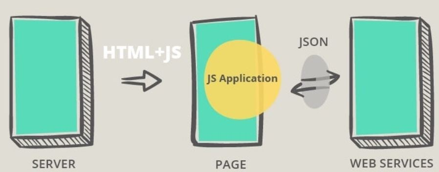
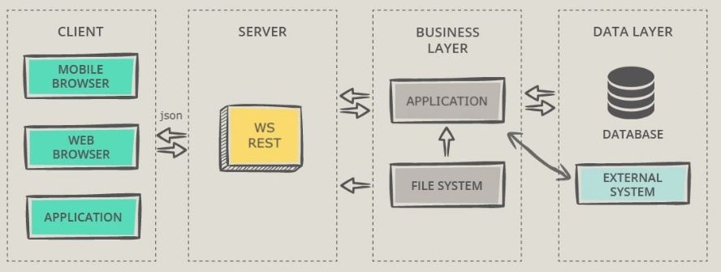

# Aula 2

## Revisão Arquitetura Web

### Arquitetura SPA (Single Page Application)


### Arquitetura API


#### Material Complementar
- [Web Application Architecture](https://existek.com/blog/web-application-architecture/)

## REST (Representational State Transfer)

É um modelo de implementação a ser utilizado para projetar sistemas distribuídos.

O padrão REST se baseia em **Recursos**, que nada mais é do que uma abstração sobre um determinado tipo de informação que uma aplicação gerencia. Por exemplo um e-commerce possui: `Cliente`, `Produto`, `Vitrine`, `Carrinho`, `Pedidos`.

## Protocolo HTTP (Hypertext Transfer Protocol)

  - URI (Uniform Resource Identifier)
  - Method
  - Header
  - Body

## URI (Uniform Resource Identifier)

A identificação do recurso deve ser feita utilizando-se o conceito de URI. Alguns exemplos de URI’s:

- `http://api-padaria-do-joaquim.com.br/produtos`
- `http://api-padaria-do-joaquim.com.br/clientes`
- `http://api-padaria-do-joaquim.com.br/vendas`

As URI’s são a **interface** de utilização dos serviços e funcionam como um **contrato** que será utilizado pelos clientes para acessá-los.

#### Material Complementar
- [Difference between URI and URL](https://dev.to/flippedcoding/what-is-the-difference-between-a-uri-and-a-url-4455)

## Method / Verbos

Cada recurso pode ser manipulado de diversas maneiras. O usuário pode querer criar um cliente novo, excluir um produto ou alterar um pedido.

Mas a URI do recurso é `http://api-padaria-do-joaquim.com.br/produtos`. Como definir a operação que será realizada ?

| Método    | Ação no Recurso |
| --------- | --------------- |
| `GET`     | Solicita a representação de um recurso. | 
| `POST`    | Submete os dados para persistência de um recurso. |
| `PUT`     | Substitui **todas** as atuais informações do recurso alvo pelo payload da requisição. |
| `PATCH`   | Aplica modificações **parciais** em um recurso. |
| `DELETE`  | Remove um recurso específico. |
| `HEAD`    | Similar ao GET, obtém apenas os cabeçalhos de resposta, sem os dados do recurso. |
| `OPTIONS` | Descreve as opções de comunicação disponíveis para o alvo. |

Os métodos mais utilizados são `GET`, `POST`, `PUT` e `DELETE`, mas se fizer sentido em sua aplicação utilizar algum dos outros métodos, não há nenhum problema nisso.

O protocolo possui 9 verbos definidos, veja todos os [HTTP Methods](https://developer.mozilla.org/pt-BR/docs/Web/HTTP/Methods).

## Header 

Dados adicionais enviados pelo agente (browser ou outra ferramenta) para dar contexto sobre a transação que está ocorrendo entre o cliente e o servidor. É possível incluir informações customizadas também.

## Request Payload

Corpo da requisição, contém os dados que estão sendo enviados. **ATENÇÃO:** `GET` não deve possuir um *Request Payload*, embora seja possível fazer isso em algumas ferramentas/frameworks (axios, por exemplo, não permite).

## Códigos HTTP

| Categoria | Descrição |
| --- | --- |
| `1xx` | Informational	Communicates transfer protocol-level information. |
| `2xx` | Success	Indicates that the client’s request was accepted successfully. |
| `3xx` | Redirection	Indicates that the client must take some additional action in order to complete their request. |
| `4xx` | Client Error	This category of error status codes points the finger at clients. |
| `5xx` | Server Error	The server takes responsibility for these error status codes. |

Categorias mais utilizadas:
  - `200 OK`
  - `201 CREATED`
  - `204 NO CONTENT`
  - `400 BAD REQUEST`
  - `401 UNAUTHORIZED`
  - `403 FORBIDDEN`
  - `404 NOT FOUND`
  - `500 INTERNAL SERVER ERROR`

[HTTP Status Codes](https://restfulapi.net/http-status-codes/)

## Endpoint

Damos o nome de **Endpoint** para a composição de uma chamada REST, ou seja: URI, Method, Header, Body e Response Status

#### Material Complementar

- [Rest: Princípios e boas práticas](http://blog.caelum.com.br/rest-principios-e-boas-praticas/)

- [Stream, Java, etc](https://www.baeldung.com/)

## Atividades HandsOn

1. Criar MotoristaController
    - Criar um `List<Motorista>` para armazenar registros na Controller
    - Criar método `POST` para cadastrar um motorista
    - Criar método `GET` para listar todos os motoristas
    - Criar método `GET` para obter 1 motorista pelo CPF
        - Usar `@PathVariable`
        - Reforçar a necessidade do Equals e HashCode nas classes `Motorista`, `Pessoa` e `CPF`
    - Criar método `DELETE` para que um motorista possa remover a sua conta
        - Reaproveitar método que busca 1 motorista pelo CPF
    - Definir um Status Code específico no retorno dos endpoints

1. Consumir a API
    - Aplicação (Front, Mobile, outra API)
    - Browser (Somente métodos `GET`)
    - [Swagger e Swagger-UI](https://swagger.io/)
      - Incluir as dependências
      
        ```xml
        <dependency>
          <groupId>io.springfox</groupId>
          <artifactId>springfox-swagger2</artifactId>
          <version>2.9.2</version>
        </dependency>
        <dependency>
          <groupId>io.springfox</groupId>
          <artifactId>springfox-swagger-ui</artifactId>
          <version>2.9.2</version>
        </dependency>    
        ```
      - Adicionar a anotação `@EnableSwagger2`
      - Acessar a url da aplicação + `/swagger-ui.html`. Ex: `http://localhost:8100/me-leva-ai/swagger-ui.html`
    - [Postman](https://www.getpostman.com/)
      - Importar a partir do json do swagger 
        - Acessar o Postman e então `Import > Import from Link`
        - copiar a url do swagger que gera o json: url da aplicação + `/v2/api-docs`. Ex: `http://localhost:8100/me-leva-ai/v2/api-docs`
