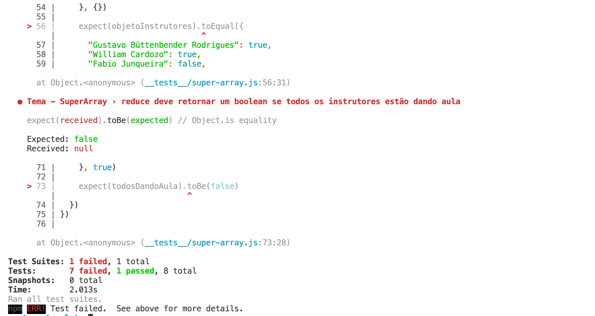

# Super Array

Vamos criar um um tipo de estrutura de dados que irá ter alguns métodos para facilitar a manipulação de arrays.

# Primeiros passos

Clone este repositório (`git clone`) e em seguida instale as dependências (`npm install`). Se deu tudo certo, ao rodar o comando `npm test`, você deverá ver algo parecido com: 



# Descrição

O objetivo desse exercício, é fazer com que os 8 testes que foram escritos passem. Para isso, implemente os seguintes métodos no arquivo `src/super-array.js`

Sugestão de ordem para implementação:
 1. push
 3. forEach
 2. map
 3. filter
 4. find
 5. reduce

## push

*Adicionar um item novo ao final do SuperArray.*

Parâmetros:
  - **item** - Item a ser adicionado no array.

Retorno: `SuperArray com o novo item ao final`

```js
// Utilização
const meuArraySemHeMan = SuperArray(1, 2, 3)
const arrayComHeMan = meuArray.push("He Man")

// arrayComHemMan.itens será [1, 2, 3, 'He Man']
```


## forEach

*Percorre todos os items do array. *

Parâmetros:
  - **callback** - Função que vai ser executada a cada iteração, recebendo um parâmetro:.
    - **item** - O item que está sendo processado no array.

Retorno: `void`

```js
// Utilização
meuArray.forEach(item => {
  console.log(item)
})
```


## filter

*Retorna um novo SuperArray com os elementos que passaram no teste implementado pela função fornecida.*

Parâmetros:
  - **callback** - Função para testar cada item do array, **deve retornar um Boolean**, recebendo um parâmetro:
    - **item** - Item que está sendo testado no array.

Retorno: `SuperArray com itens filtrados`

```js
// Utilização
const meuArray = SuperArray(1, 2, 3)

const meuArrayImpares = meuArray.filter(item => {
  return item % 2 !== 0
})

// meuArrayImpares.itens será [1, 3]
```

## map

*Retorna um novo SuperArray com os elementos remapeados.*

Parâmetros:
  - **callback** - Função para mapear o novo item do array, **deve retornar o novo item**, recebendo um parâmetro:
    - **item** - Item que está sendo processado no array.

Retorno: `SuperArray com itens mapeados`

```js
// Utilização
const meuArray = SuperArray([1, 2, 3])

const meuArrayDobrado = meuArray.map(item => {
  return item * 2
})

// meuArrayDobrado.itens será [2, 4, 6]
```

## find

*Retorna o primeiro valor do SuperArray que satisfaça o callback fornecido. Nao encontrando, deve retornar undefined*

Parâmetros:
  - **callback** - Função para testar cada item do array, **deve retornar um Boolean**, recebendo um parâmetro:
    - **item** - Item que está sendo processado no array.

Retorno: `Item encontrado ou undefined`

```js
// Utilização
const meuArray = SuperArray(1, 2, 3)

const primeiroNumeroMarioQue1 = meuArray.find(item => {
  return item > 1
})

// primeiroNumeroMarioQue1 será 2
```

## reduce

*Reduz todo o array em um único valor.*

Parâmetros:
  - **callback** - Função que é executada em cada valor do array, **deve retornar o parâmetro acumulador**, recebendo dois parâmetros:
    - **acumulador** - O valor retornado na última invocação do callback, ou o argumento valorInicial, se fornecido.
    - **item** - O item que está sendo processado no array.
  - **valorInicial** - Objeto a ser usado como o primeiro argumento da primeira chamada da função callback.

Retorno: `Um único valor de qualquer tipo (string, number, boolean, etc)`

```js
// Utilização
const meuArray = SuperArray(1, 2, 3)

const somaMeuArray = meuArray.reduce((acumulador, item) => {
  return acumulador += item
}, 0)

// somaMeuArray será 6
```

# IMPORTANTE!
**NÃO PODE UTILIZAR OS MÉTODOS DO ARRAY NATIVO, TODOS OS MÉTODOS DEVEM SER IMPLEMENTADOS DO ZERO!** 

Dica: implemente uma função por vez, e sempre rode `npm test` para ver o andamento. A cada função implementada corretamente, um teste vai passar.
