# Megazord Simulator

### Se alguem não sabe do que estamos falando

- https://www.youtube.com/watch?v=nMItA-G8ej4

- https://powerrangers.fandom.com/wiki/Megazord

## Objetivo

**Será construida uma aplicação para calcular as dimensões de um Megazord, dados os Zords que o compõem.**

### Zords

#### Mastodon Dinozord

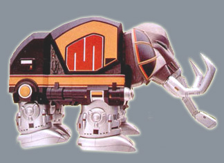

##### Atributos:

- Comprimento: 25 m
- Altura: 15 m
- Peso: 108 tons
- Velocidade: 120 km/h

#### Pterodactyl Dinozord

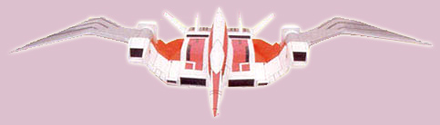

##### Atributos:

- Comprimento: 21 m
- Altura: 10 m
- Peso: 84 tons
- Velocidade: 3087 km/h

#### Sabertooth Tiger Dinozord

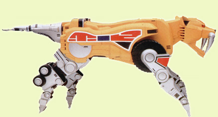

##### Atributos:

- Comprimento: 37 m
- Altura: 13 m
- Peso: 141 tons
- Velocidade: 150 km/h

#### Triceraptops Dinozord

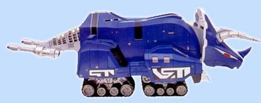

##### Atributos:

- Comprimento: 37 m
- Altura: 11 m
- Peso: 141 tons
- Velocidade: 140 km/h

#### Tyrannosaurus Dinozord

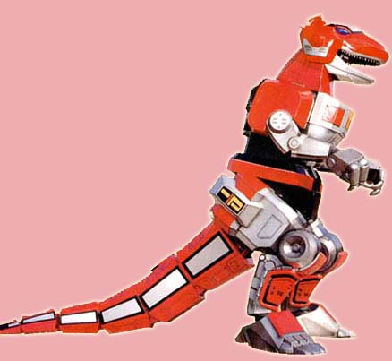

##### Atributos:

- Comprimento: 45 m
- Altura: 27 m
- Peso: 96 tons
- Velocidade: 120 km/h

#### Black Frog Ninjazord

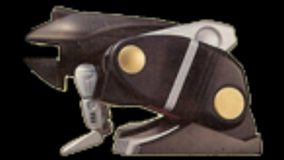

##### Atributos:

- Comprimento: 20 m
- Altura: 31 m
- Peso: 2000 tons
- Velocidade: 120 km/h

#### Blue Wolf Ninjazord

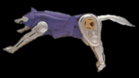

##### Atributos:

- Comprimento: 33 m
- Altura: 39 m
- Peso: 1300 tons
- Velocidade: 90 km/h

#### Pink Creane Ninjazord

##### Atributos:

- Comprimento: 21 m
- Altura: 15 m
- Peso: 600 tons
- Velocidade: 2469 km/h

#### Yellow Bear Ninjazord

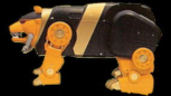

##### Atributos:

- Comprimento: 28 m
- Altura: 30 m
- Peso: 2000 tons
- Velocidade: 70 km/h

#### Red Monkey Ninjazord

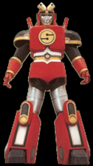

##### Atributos:

- Comprimento: 20 m
- Altura: 31 m
- Peso: 1300 tons
- Velocidade: 60 km/h

### Megazord

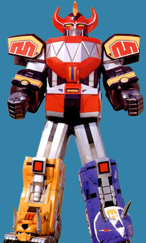
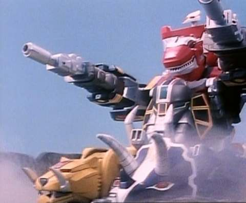

Deve ser criada uma classe correspondente ao megazord no modo de batalha e no modo de tanque. Cada uma conta com os seguintes atributos:

- Megazord Battle Mode
    - cabeça
    - peito
    - braços
    - perna esquerda
    - perna direita
   
- Megazord Tank Mode
    - centro
    - topo
    - canhão
    - roda esquerda
    - roda direita

#### Restrições:

**MegazordBattleMode**

- O atributo cabeça só aceita objetos do tipo `PinkCraneNinjazord` e `TyrannossaurusDinozord`
- O atributo peito só aceita objetos do tipo `YellowBearNinjazord` e `PterodactylDinozord`
- O atributo braços só aceita objetos do tipo `BlackFrogNinjazord` e `MastodonDinozord`
- Os atributos perna esquerda e direita só aceitam objetos do tipo `BlueWolfNinjazord`, `RedApeNinjazord`, 
`SabertoothTigerDinozord` e `TriceraptopsDinozord`

**MegazordTankMode**

- O atributo centro só aceita objetos do tipo `TyrannosaurusDinozord`
- O atributo topo só aceita objetos do tipo `PterodactylDizozord`
- O atributo canhão só aceita objetos do tipo `MastodonDinozord`
- Os atributos roda esquerda e direita só aceitam objetos do tipo `SabertoothTigerDinozord`, `TriceraptopsDinozord`

Se o código de vocês **COMPILAR** passando qualquer coisa que não sejam esses objetos no lugar desses parametros está 
**ERRADO**.

## MegazordBattleMode

Deve conter os seguintes métodos:

- `getComprimento` calculado da seguinte forma `(comprimento perna esquerda + comprimento perna direita) / 2`
- `getAltura` calculado da seguinte forma `altura cabeça + altura peito + (altura perna esquerda + altura perna direita) / 2`
- `getPeso` calculado da seguinte forma `soma do peso de todas as partes`
- `getVelocidade` calculado da seguinte forma `(velocidade perna esquerda + velocidade perna direita) / 3`

## MegazordTankMode

Deve conter os seguintes métodos:

- `getComprimento` calculado da seguinte forma `comprimento roda esquerda + comprimento roda direita`
- `getAltura` calculado da seguinte forma `soma da altura de todas as partes`
- `getPeso` calculado da seguinte forma `soma do peso de todas as partes`
- `getVelocidade` calculado da seguinte forma `(velocidade roda esquerda + velocidade roda direita) * 2`

## Boa sorte!

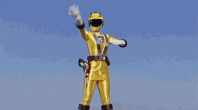